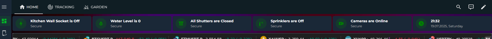
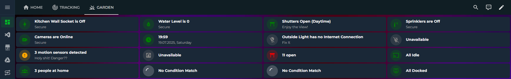
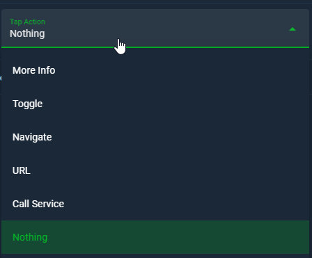
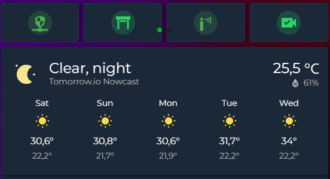

<a href="https://www.buymeacoffee.com/cataseven" target="_blank">
  
</a>      

# Summary Card for Home Assistant
---


Transform your Home Assistant dashboard into a responsive, intelligent, and beautiful control center. **Summary Card** lets you create compact, domain-based visual summaries with dynamic styling, real-time templating, and smart defaults.

This is not just another Lovelace card. It's a highly customizable system for building status dashboards that feel alive.


---

## ✨ Features

- **Responsive Grid Layout:** Define the number of columns and height per row.
- **Domain-Aware Conditions:** Each domain (light, climate, etc.) has intelligent predefined conditions like "If Any On", "If All Idle", etc.
- **Template-Backed Conditions:** Use full Jinja templates for advanced logic in combination with default logic.
- **Clock Support:** Add a live-updating card showing the current time and date.
- **Auto-Fill on First Use:** Automatically fills in cards based on detected domains on first load.
- **Fully Visual Editor:** No YAML required. Add/edit cards, conditions, and templates via a clean UI.
- **Jinja in Text:** Use template placeholders like `{{ active_count }}` or even backend-evaluated Jinja strings inside `text` and `secondary_text`.
- **Tap Actions:** More Info, Navigate, URL, Perform Action, Nothing...
  
---

## 🛠 Installation

### HACS (Recommended)

1. Go to **HACS > Frontend**.
2. Click "Explore & Download Repositories".
3. Search for **Summary Card** and install it.
4. Refresh your browser.

### Manual

1. Download `summary-card.js` from the [releases](https://github.com/YOUR_USERNAME/summary-card/releases).
2. Place it in `config/www/`.
3. Add as a resource:

```yaml
# Configuration > Dashboards > Resources
url: /local/summary-card.js
type: module
```

---

## ⚙ Configuration Options

### ADDING CARD TO DASHBOARD
Search from the picker: Summary Card
Card detects your available domains automatically. You can modify as you want


### UI EDITOR


### HIERARCHY

ADD DOMAIN CARD -> SELECT DOMAIN -> ADD SCENARIO -> SET OUTPUTS<br>
<p>Also you can OPTIONALLY: add template conditions to your scenarios<br>
Also you can OPTIONALLY: include only spesific entities of the domain<br>
Also you can OPTIONALLY: exclude spesific entities from the domain<br>

Card try to create card for all available domains. You can modify auto-prepared card!

<br>
<br>

### Root Config

| Option        | Type     | Required | Description                                 | Default |
| ------------- | -------- | -------- | ------------------------------------------- | ------- |
| `type`        | string   | ✅       | Always `custom:summary-card`                | -       |
| `columns`     | integer  | ❌       | Number of cards per row                     | `6`     |
| `row_height`  | string   | ❌       | CSS height like `60px`, `10vh`, etc.        | `55px`  |
| `cards`       | array    | ✅       | List of cards (domain or clock)             | -       |

---

#### 1. **Domain Card**

| Option         | Type     | Required | Description                                      |
| -------------- | -------- | -------- | ------------------------------------------------ |
| `domain`       | string   | ✅       | Domain like `light`, `switch`, `sensor`, etc.    |
| `name`         | string   | ❌       | Optional - Display name                        |
| `include`      | array    | ❌       | Optional - List of `entity_id`s to include. Only consider these entities. Forget the others               |
| `exclude`      | array    | ❌       | Optional - List of `entity_id`s to exclude. Consider all entities of the domain but exlude this ones                 |
| `styles`       | array    | ✅       | Array of style rules based on conditions         |

#### 2. **Clock Card**

| Option         | Type     | Required | Description                                      |
| -------------- | -------- | -------- | ------------------------------------------------ |
| `domain`       | string   | ✅       | Must be `"clock"`                                |
| `color`        | string   | ❌       | Icon circle color (`green`, `#ff0000`, etc.)     |

---

### Style Rules (Inside `styles`)

Each style block is evaluated top to bottom. The first matching rule is applied.

| Option              | Type     | Required | Description |
| -------------------| -------- | -------- | ----------- |
| `condition`         | string   | ✅       | One of the predefined domain-aware keywords like `if_any_on`, `if_all_off`, `any_unavailable`, for all entities of the selected domain etc. |
| `text`              | string   | ❌       | Main line (can include Jinja placeholders) |
| `secondary_text`    | string   | ❌       | Subtext (also supports Jinja)              |
| `icon`              | string   | ❌       | Material Design Icon (`mdi:`)              |
| `color`             | string   | ❌       | CSS color or theme variable                |
| `value`             | number/string | ❌   | Required only for sensor domain rules like `equal`, `above`, `below`, etc. |
| `template_conditions` | array | ❌       | List of Jinja template strings that must evaluate to `true` |

---

### Domain Conditions Overview

| Domain         | Available Conditions |
|----------------|----------------------|
| `light`, `switch` | `if_any_on`, `if_all_off`, `any_unavailable`, ... |
| `binary_sensor` | `if_any_true`, `if_all_false`, ... |
| `sensor` | `if_any_above`, `if_any_below`, `equal`, `not_equal`, `any_unavailable` |
| `camera`, `media_player`, `vacuum`, etc. | Tailored domain logic like `if_any_streaming`, `if_all_idle`, etc. |

For example:

```yaml
- domain: sensor
  name: Temperature
  include:
    - sensor.living_room_temp
  styles:
    - condition: if_any_above
      value: 28
      text: "Hot! ({{ active_count }} over 28°C)"
      icon: mdi:thermometer
      color: red
```

---

### Dynamic Template Variables

The following are available in any `text` or `secondary_text` string:

- `{{ active_count }}` - Returns the number of on/true/active entities of the domain. For example {{ active_count }} people at home = 3 People At Home 
- `{{ inactive_count }}`- Returns the number of off/false/passive entities of the domain. For example {{ inactive_count }} lights are off = 4 lights are off 
- `{{ unavailable_count }}`- Returns the number of unavailabel entities of the domain. For example {{ inactive_count }} cameras are diconnected = 2 cameras are disconnected

You can also use full Jinja expressions, including custom Home Assistant state queries inside `template_conditions`.

Example:

```yaml
template_conditions:
  - "{{ is_state_attr('switch.kitchen', 'current', 0) }}"
  - "{{ now().hour >= 0 and now().hour < 5 }}"
```

---

### Include / Exclude Entities
Via Include Enitites option, you can easily create card for only one entity of the selected domain (or two, or three.. depens on your need)
Via Exlude Enitites option, you can easily exclude one entitiy (or two, or three.. depens on your needs) from your selected domain and create card for the rest of the domain

### Tap Actions


### Call Service Schema
```yaml
type: custom:summary-card
columns: 6
row_height: 60px
cards:
  - domain: switch
    name: Kitchen Wall Socket
    include:
      - switch.kitchen
    styles:
      - condition: any_unavailable
        text: Kitchen Wall Socket is Unavailable
        secondary_text: Check Device
        icon: mdi:lightning-bolt
        color: red
    tap_action:
      action: call-service
      service: light.toggle
      target:
        entity_id: light.backyard,light.on_bahce,light.pool_light
```

## 🎨 Tap Action - More Info Screenshots


## 🎨 Configuration Examples
### Example 1: Example form my own Dashboard. This is the start point of this project.


```yaml
type: custom:summary-card # Specifies the card type.
columns: "6"
row_height: 60px
cards:
  - domain: switch # The domain of the entities to be monitored (e.g., switch, light, sensor).
    name: Kitchen Wall Socket # A friendly name for the card.
    include: # only this entity will be listened
      - switch.kitchen
    styles: 
      # Style for when the socket is unavailable.
      - condition: any_unavailable # If any of the included entities are unavailable.
        text: Kitchen Wall Socket is Unavailable # The main text to display.
        secondary_text: Check Device # The smaller text below the main text.
        icon: mdi:lightning-bolt # The icon to show.
        color: red # The color of the icon.
      # Style for when the socket is off and drawing no power.
      - condition: all_inactive # If all of the included entities are off.
        text: Kitchen Wall Socket is Off
        secondary_text: Secure
        icon: mdi:lightning-bolt
        color: green
        template_conditions: # Additional conditions using templates.
          # This template checks if the 'current' attribute of the switch is 0.
          - "{{ is_state_attr('switch.kitchen', 'current', 0) }}"
      # Style for when the socket is on and drawing power.
      - condition: any_active # If any of the included entities are on.
        text: Kitchen Wall Socket is On
        secondary_text: >- # The '>' allows for multi-line strings.
          Warning! Check the Device! Current value is
          {{state_attr('switch.kitchen', 'current')}} # Displays the current power draw.
        icon: mdi:lightning-bolt
        color: red
        template_conditions:
          # This template checks if the 'current' attribute is not 0.
          - "{{ not is_state_attr('switch.kitchen', 'current', 0) }}"
  - domain: sensor
    name: Water Level
    include:
      - sensor.current_water_level
    styles:
      # Style for when the sensor is unavailable.
      - condition: any_unavailable
        text: Water Level is Unavailable
        secondary_text: Check Device
        icon: mdi:water-percent-alert
        color: red
      # Style for when the water level is at 0.
      - condition: equal # Condition based on the sensor's value.
        value: 0 # The value to compare against.
        text: Water Level is 0
        secondary_text: Secure
        icon: mdi:water-percent
        color: green
        template_conditions: [] # No extra template conditions needed here.
      # Style for when the water level is not 0.
      - condition: not_equal
        value: "0" # The value to compare against (as a string).
        text: >-
          Water Level is {{state_attr('sensor.current_water_level', 'raw_state')}}
        secondary_text: >-
          Warning! Check the Engine Room! Current value is
          {{state_attr('sensor.current_water_level', 'raw_state')}}
        icon: mdi:water-percent-alert
        color: red
        template_conditions: []
  - domain: cover
    name: Shutters & Garage
    styles:
      # Style for when the garage door is open.
      - condition: any_active
        text: Garage Door is Open
        secondary_text: Warning!
        icon: mdi:garage-alert-variant
        color: red
        template_conditions:
          # Checks if the garage door binary sensor is 'on'.
          - "{{ is_state('binary_sensor.garage_door', 'on') }}"
      # Style for when all shutters are closed and available.
      - condition: all_inactive
        text: All Shutters are Closed
        secondary_text: Secure
        icon: mdi:window-shutter
        color: green
        template_conditions:
          # A complex template to check the state of all covers.
          - >-
            
            
            {{ open_shutters | length == 0 and un_shutters | length == 0 }}
      # Style for when any shutter is open during the night.
      - condition: any_active
        text: Shutters Open (Night)
        secondary_text: Check Security
        icon: mdi:window-shutter-open
        color: red
        template_conditions:
          # Checks if the current time is between midnight and 5 AM.
          - "{{ now().hour >= 0 and now().hour < 5 }}"
      # Style for when any shutter is open and the family is away.
      - condition: any_active
        text: Shutters Open (Away)
        secondary_text: Check Security
        icon: mdi:window-shutter-open
        color: red
        template_conditions:
          - "{{ is_state('group.family', 'away') }}"
      # Style for when any shutter is unavailable and the family is away.
      - condition: any_unavailable
        text: Unavailable Shutters (Away)
        secondary_text: Immediate Attention Needed!
        icon: mdi:window-shutter-alert
        color: red
        template_conditions:
          - "{{ is_state('group.family', 'away') }}"
      # Style for when any shutter is unavailable and the family is home.
      - condition: any_unavailable
        text: Unavailable Shutters (Home)
        secondary_text: Check Devices!
        icon: mdi:window-shutter-alert
        color: orange
        template_conditions:
          - "{{ is_state('group.family', 'home') }}"
      # Style for when any shutter is open during the day and the family is home.
      - condition: any_active
        text: Shutters Open (Daytime)
        secondary_text: Enjoy the View!
        icon: mdi:window-shutter-open
        color: green
        template_conditions:
          # Checks if the family is home and the time is between 5 AM and 11:59 PM.
          - >-
            {{ is_state('group.family', 'home') and ('05:00' <= now().strftime('%H:%M') <= '23:59')}}
  - domain: switch
    name: Sprinklers
    include:
      - switch.zone_1
      - switch.zone_2
      - switch.zone_3
      - switch.zone_4
      - switch.zone_5
      - switch.zone_6
      - switch.zone_7
      - switch.zone_8
      - switch.zone_9
      - switch.zone_10
      - switch.zone_11
    styles:
      # Style for when any sprinkler switch is unavailable.
      - condition: any_unavailable
        text: Unavailable
        secondary_text: Check Device
        icon: mdi:wifi-off
        color: red
      # Style for when all sprinklers are off.
      - condition: all_inactive
        text: Sprinklers are Off
        secondary_text: Secure
        icon: mdi:sprinkler
        color: green
      # Style for when any sprinkler is on.
      - condition: any_active
      # Displays the name of the active sprinkler.
        text: >-
          
          
          {{on_switch.name}} is On
        secondary_text: Watering
        icon: mdi:sprinkler-variant
        color: blue
  - domain: camera
    name: Cameras
    styles:
      # Style for when one or more cameras are offline.
      - condition: any_unavailable
        text: One or More Cameras are Offline
        secondary_text: Check Cameras
        icon: mdi:video-box-off
        color: red
      # Style for when all cameras are online.
      - condition: all_active
        text: Cameras are Online
        secondary_text: Secure
        icon: mdi:video-check
        color: green
    include:
      - camera.front
      - camera.garage
      - camera.side
      - camera.pool
  - domain: clock
    name: Clock
    color: green # The color of the clock icon.
```


### Example 2: Basic Lights & Switches Setup

A great starting point that covers the most common use case.

```yaml
# The card type must always be 'custom:summary-card'.
type: custom:summary-card

#================================================
# GENERAL SETTINGS
#================================================
# Defines how many cards are displayed in a single row.
columns: 2
# Sets the height of each card in pixels.
row_height: 80px

#================================================
# CARDS LIST
# Each section starting with a dash (-) defines a new card.
#================================================
cards:
  # --- EXAMPLE 1: LIGHTS CARD ---
  # This card tracks all entities in the 'light' domain.
  # Use 'include' or 'exclude' to specify which lights to track.
  - domain: light
    name: Lights

    # STYLES (SCENARIOS)
    # The card evaluates these styles from top to bottom and applies the FIRST one that meets the conditions.
    # Therefore, you should place your most specific or highest-priority conditions at the top.
    styles:
      # Scenario 1: Is at least one light currently on?
      - condition: if_any_on
        # The 'text' field supports templates. '{{ active_count }}' is a built-in variable
        # that shows the number of entities in an "active" state (e.g., 'on').
        text: '{{ active_count }} On'
        icon: mdi:lightbulb-on
        color: 'rgb(255, 193, 7)' # Amber color for the icon

      # Scenario 2: Are all lights off? (And not unavailable)
      # This acts as the default state if no other condition is met.
      - condition: if_all_off
        text: All Off
        icon: mdi:lightbulb-off-outline
        # Uses your theme's primary text color.
        color: 'var(--primary-text-color)'

  # --- EXAMPLE 2: SWITCHES CARD ---
  # This card tracks all entities in the 'switch' domain.
  - domain: switch
    name: Switches
    styles:
      # Scenario 1 (HIGHEST PRIORITY): Is any switch unavailable/offline?
      # This condition is checked first to immediately report connectivity issues.
      - condition: any_unavailable
        # '{{ unavailable_count }}' shows how many entities are unavailable.
        text: '{{ unavailable_count }} Offline'
        icon: mdi:power-plug-off
        color: 'grey'

      # Scenario 2: If none are unavailable, is at least one switch on?
      - condition: if_any_on
        text: '{{ active_count }} Active'
        icon: mdi:power-plug
        color: 'dodgerblue'

      # Scenario 3: If all switches are available and none are on, they must all be off.
      - condition: if_all_off
        text: All Off
        icon: mdi:power-plug-off-outline
        color: 'var(--primary-text-color)'
```
### Example 3: Advanced "Home Status" Dashboard

This example demonstrates filtering, multiple conditions, and a mix of card types for a comprehensive overview.

```yaml
type: custom:summary-card
columns: 4
row_height: 95px
cards:
  # --- CARD 1: Clock ---
  # This is a special card that doesn't track any entities; it simply displays the current time.
  - domain: clock
    # Uses your theme's primary color for the icon.
    color: 'var(--primary-color)'

  # --- CARD 2: Person Status Summary ---
  # This card tracks entities in the 'person' domain to summarize who is at home.
  - domain: person
    name: People
    styles:
      # Rule 1: If at least one person is home...
      # For the 'person' domain, the 'home' state is considered "active".
      - condition: if_any_at_home
        # The '{{ active_count }}' variable shows the number of entities in an active state.
        text: '{{ active_count }} at Home'
        icon: mdi:home-account
        color: '#4CAF50' # Green

      # Rule 2: If everyone is away...
      - condition: if_everyone_away
        text: Everyone Away
        icon: mdi:home-export-outline
        color: '#FF9800' # Orange

  # --- CARD 3: Security (Door/Window) Summary ---
  # This card only tracks the specified door and window sensors.
  - domain: binary_sensor
    name: Security
    # With 'include', only the status of sensors in this list is considered.
    include:
      - binary_sensor.front_door
      - binary_sensor.back_door
      - binary_sensor.living_room_window
    styles:
      # Rule 1: If any door or window is open...
      # For 'binary_sensor', the 'on' (true) state is considered "active".
      - condition: if_any_true
        text: '{{ active_count }} Open!'
        secondary_text: Unsecured
        icon: mdi:shield-alert
        color: 'crimson'

      # Rule 2: If all doors and windows are closed...
      - condition: if_all_false
        text: All Secure
        secondary_text: House is locked down
        icon: mdi:shield-check
        color: 'teal'

  # --- CARD 4: Media Player Summary ---
  # This card summarizes media players, EXCLUDING the one in the guest room.
  - domain: media_player
    name: Media
    # With 'exclude', entities in this list are not included in the summary calculation.
    exclude:
      - media_player.guest_room_display
    styles:
      # Rule 1: If any media player is active...
      # For 'media_player', states like 'playing' or 'on' are considered "active".
      - condition: if_any_playing
        text: '{{ active_count }} Playing'
        icon: mdi:cast-connected
        color: 'deepskyblue'

      # Rule 2: If all media players are idle...
      - condition: if_all_idle
        text: All Idle
        icon: mdi:cast
        color: 'var(--secondary-text-color)'
```


### Example 4: Creative Use Case - Plant Care Dashboard
Do you have plant moisture sensors? You can create a card to tell you when your plants are thirsty! This assumes your moisture sensors are binary_sensors that are 'on' (active) when the plant is dry.

```yaml
type: custom:summary-card
columns: 1
cards:
  # --- PLANT CARE CARD ---
  # This card summarizes the status of multiple plant moisture sensors.
  - domain: binary_sensor
    name: Plant Care
    # You should list the entity_ids of your own plant moisture sensors in the 'include' section.
    # This list ensures that only the specified sensors are tracked.
    include:
      - binary_sensor.fiddle_leaf_fig_moisture
      - binary_sensor.snake_plant_moisture
      - binary_sensor.monstera_moisture

    # STYLES (SCENARIOS)
    # The card evaluates conditions from top to bottom and applies the first style that matches.
    styles:
      # Rule 1: Does any plant need water?
      # For a 'binary_sensor', the 'on' (true) state is considered "active".
      # In this example, an 'on' state from the sensor means the soil is dry.
      - condition: if_any_true
        # The '{{ active_count }}' variable shows the number of plants that need water.
        text: '{{ active_count }} Thirsty Plant(s)'
        secondary_text: Time to get the watering can!
        icon: mdi:water-alert
        color: '#E53935' # Red

      # Rule 2: Are all plants sufficiently watered?
      # If the above condition is not met, this will be shown as the default state.
      - condition: if_all_false
        text: Plants are Happy
        secondary_text: All watered and content
        icon: mdi:leaf
        color: '#388E3C' # Green
```

### Example 5: Just Icons For Mobile Phone
No need to words? Are icons are ok for your small screen?


```yaml
type: custom:summary-card
columns: "10"
row_height: 60px
cards:
  - domain: switch
    include:
      - switch.kitchen
    styles:
      - condition: any_unavailable
        icon: mdi:lightning-bolt
        color: red
      - condition: if_all_off
        icon: mdi:lightning-bolt
        color: green
        template_conditions:
          - "{{ is_state_attr('switch.kitchen', 'current', 0) }}"
      - condition: if_any_on
        icon: mdi:lightning-bolt
        color: red
        template_conditions:
          - "{{ not is_state_attr('switch.kitchen', 'current', 0) }}"
  - domain: sensor
    include:
      - sensor.current_water_level
    styles:
      - condition: any_unavailable
        icon: mdi:water-percent-alert
        color: red
      - condition: if_any_equal
        value: "0"
        icon: mdi:water-percent
        color: green
        template_conditions: []
      - condition: if_any_not_equal
        value: "0"
        icon: mdi:water-percent-alert
        color: red
        template_conditions: []
  - domain: cover
    styles:
      - condition: if_any_open
        icon: mdi:garage-alert-variant
        color: red
        template_conditions:
          - "{{ is_state('binary_sensor.garage_door', 'on') }}"
      - condition: if_all_closed
        icon: mdi:window-shutter
        color: green
        template_conditions:
          - >-
              {{ open_shutters | length ==
            0 and un_shutters | length == 0 }}
      - condition: if_any_open
        icon: mdi:window-shutter-open
        color: red
        template_conditions:
          - "{{ now().hour >= 0 and now().hour < 5 }}"
      - condition: if_any_open
        icon: mdi:window-shutter-open
        color: red
        template_conditions:
          - "{{ is_state('group.family', 'away') }}"
      - condition: any_unavailable
        icon: mdi:window-shutter-alert
        color: red
        template_conditions:
          - "{{ is_state('group.family', 'away') }}"
      - condition: any_unavailable
        icon: mdi:window-shutter-alert
        color: orange
        template_conditions:
          - "{{ is_state('group.family', 'home') }}"
      - condition: if_any_open
        icon: mdi:window-shutter-open
        color: green
        template_conditions:
          - >-
            {{ is_state('group.family', 'home') and ('05:00' <=
            now().strftime('%H:%M') <= '23:59')}}
  - domain: switch
    include:
      - switch.zone_1
      - switch.zone_2
      - switch.zone_3
      - switch.zone_4
      - switch.zone_5
      - switch.zone_6
      - switch.zone_7
      - switch.zone_8
      - switch.zone_9
      - switch.zone_10
      - switch.zone_11
    styles:
      - condition: any_unavailable
        icon: mdi:wifi-off
        color: red
      - condition: if_all_off
        icon: mdi:sprinkler
        color: green
      - condition: if_any_on
        text: >-
            {{on_switch.name}} is On
        icon: mdi:sprinkler-variant
        color: blue
  - domain: camera
    styles:
      - condition: any_unavailable
        icon: mdi:video-box-off
        color: red
      - condition: if_any_streaming
        icon: mdi:video-check
        color: green

```
---
## ⭐ Support

<a href="https://www.buymeacoffee.com/cataseven" target="_blank">
  
</a>      

If you like this card, feel free to ⭐ star the project on GitHub and share it with the Home Assistant community!
---

## 📄 License

MIT © [cataseven]

---
