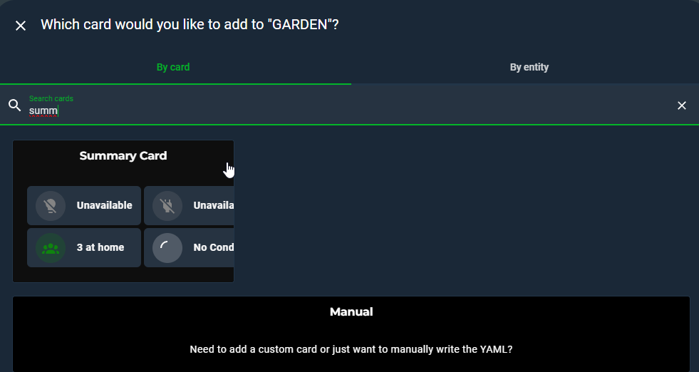

# Summary Card for Home Assistant
---

Transform your Home Assistant dashboard into a responsive, intelligent, and beautiful control center. **Summary Card** lets you create compact, domain-based visual summaries with dynamic styling, real-time templating, and smart defaults.

This is not just another Lovelace card. It's a highly customizable system for building status dashboards that feel alive.


---

## ✨ Features

- **Responsive Grid Layout:** Define the number of columns and height per row.
- **Domain-Aware Conditions:** Each domain (light, climate, etc.) has intelligent predefined conditions like "If Any On", "If All Idle", etc.
- **Template-Backed Conditions:** Use full Jinja templates for advanced logic in combination with default logic.
- **Clock Support:** Add a live-updating card showing the current time and date.
- **Auto-Fill on First Use:** Automatically fills in cards based on detected domains on first load.
- **Fully Visual Editor:** No YAML required. Add/edit cards, conditions, and templates via a clean UI.
- **Jinja in Text:** Use template placeholders like `{{ active_count }}` or even backend-evaluated Jinja strings inside `text` and `secondary_text`.

---

## 🛠 Installation

### HACS (Recommended)

1. Go to **HACS > Frontend**.
2. Click "Explore & Download Repositories".
3. Search for **Summary Card** and install it.
4. Refresh your browser.

### Manual

1. Download `summary-card.js` from the [releases](https://github.com/YOUR_USERNAME/summary-card/releases).
2. Place it in `config/www/`.
3. Add as a resource:

```yaml
# Configuration > Dashboards > Resources
url: /local/summary-card.js
type: module
```

---

## ⚙ Configuration Options

### ADDING CARD TO DASHBOARD
Search from the picker: Summary Card
Card detects your available domains automatically. You can modify as you want



### UI EDITOR


### HIERARCHY

ADD DOMAIN CARD -> SELECT DOMAIN -> ADD SCENARIO -> SET OUTPUTS<br>
<p>Also you can OPTIONALLY: add template conditions to your scenarios<br>
Also you can OPTIONALLY: include only spesific entities of the domain<br>
Also you can OPTIONALLY: exclude spesific entities from the domain<br>

<br>
<br>

### Root Config

| Option        | Type     | Required | Description                                 | Default |
| ------------- | -------- | -------- | ------------------------------------------- | ------- |
| `type`        | string   | ✅       | Always `custom:summary-card`                | -       |
| `columns`     | integer  | ❌       | Number of cards per row                     | `6`     |
| `row_height`  | string   | ❌       | CSS height like `60px`, `10vh`, etc.        | `55px`  |
| `cards`       | array    | ✅       | List of cards (domain or clock)             | -       |

---

#### 1. **Domain Card**

| Option         | Type     | Required | Description                                      |
| -------------- | -------- | -------- | ------------------------------------------------ |
| `domain`       | string   | ✅       | Domain like `light`, `switch`, `sensor`, etc.    |
| `name`         | string   | ❌       | Optional - Display name                        |
| `include`      | array    | ❌       | Optional - List of `entity_id`s to include. Only consider these entities. Forget the others               |
| `exclude`      | array    | ❌       | Optional - List of `entity_id`s to exclude. Consider all entities of the domain but exlude this ones                 |
| `styles`       | array    | ✅       | Array of style rules based on conditions         |

#### 2. **Clock Card**

| Option         | Type     | Required | Description                                      |
| -------------- | -------- | -------- | ------------------------------------------------ |
| `domain`       | string   | ✅       | Must be `"clock"`                                |
| `color`        | string   | ❌       | Icon circle color (`green`, `#ff0000`, etc.)     |

---

### Style Rules (Inside `styles`)

Each style block is evaluated top to bottom. The first matching rule is applied.

| Option              | Type     | Required | Description |
| -------------------| -------- | -------- | ----------- |
| `condition`         | string   | ✅       | One of the predefined domain-aware keywords like `if_any_on`, `if_all_off`, `any_unavailable`, for all entities of the selected domain etc. |
| `text`              | string   | ❌       | Main line (can include Jinja placeholders) |
| `secondary_text`    | string   | ❌       | Subtext (also supports Jinja)              |
| `icon`              | string   | ❌       | Material Design Icon (`mdi:`)              |
| `color`             | string   | ❌       | CSS color or theme variable                |
| `value`             | number/string | ❌   | Required only for sensor domain rules like `equal`, `above`, `below`, etc. |
| `template_conditions` | array | ❌       | List of Jinja template strings that must evaluate to `true` |

---

### Domain Conditions Overview

| Domain         | Available Conditions |
|----------------|----------------------|
| `light`, `switch` | `if_any_on`, `if_all_off`, `any_unavailable`, ... |
| `binary_sensor` | `if_any_true`, `if_all_false`, ... |
| `sensor` | `if_any_above`, `if_any_below`, `equal`, `not_equal`, `any_unavailable` |
| `camera`, `media_player`, `vacuum`, etc. | Tailored domain logic like `if_any_streaming`, `if_all_idle`, etc. |

For example:

```yaml
- domain: sensor
  name: Temperature
  include:
    - sensor.living_room_temp
  styles:
    - condition: if_any_above
      value: 28
      text: "Hot! ({{ active_count }} over 28°C)"
      icon: mdi:thermometer
      color: red
```

---

### Dynamic Template Variables

The following are available in any `text` or `secondary_text` string:

- `{{ active_count }}` - Returns the number of on/true/active entities of the domain. For example {{ active_count }} people at home = 3 People At Home 
- `{{ inactive_count }}`- Returns the number of off/false/passive entities of the domain. For example {{ inactive_count }} lights are off = 4 lights are off 
- `{{ unavailable_count }}`- Returns the number of unavailabel entities of the domain. For example {{ inactive_count }} cameras are diconnected = 2 cameras are disconnected

You can also use full Jinja expressions, including custom Home Assistant state queries inside `template_conditions`.

Example:

```yaml
template_conditions:
  - "{{ is_state_attr('switch.kitchen', 'current', 0) }}"
  - "{{ now().hour >= 0 and now().hour < 5 }}"
```

---


## 🎨 Configuration Examples
### Example 1: Example form my own Dashboard. This is the start point of this project.


```yaml
type: custom:summary-card # Specifies the card type.
columns: "6"
row_height: 60px
cards:
  - domain: switch # The domain of the entities to be monitored (e.g., switch, light, sensor).
    name: Kitchen Wall Socket # A friendly name for the card.
    include: # only this entity will be listened
      - switch.kitchen
    styles: 
      # Style for when the socket is unavailable.
      - condition: any_unavailable # If any of the included entities are unavailable.
        text: Kitchen Wall Socket is Unavailable # The main text to display.
        secondary_text: Check Device # The smaller text below the main text.
        icon: mdi:lightning-bolt # The icon to show.
        color: red # The color of the icon.
      # Style for when the socket is off and drawing no power.
      - condition: all_inactive # If all of the included entities are off.
        text: Kitchen Wall Socket is Off
        secondary_text: Secure
        icon: mdi:lightning-bolt
        color: green
        template_conditions: # Additional conditions using templates.
          # This template checks if the 'current' attribute of the switch is 0.
          - "{{ is_state_attr('switch.kitchen', 'current', 0) }}"
      # Style for when the socket is on and drawing power.
      - condition: any_active # If any of the included entities are on.
        text: Kitchen Wall Socket is On
        secondary_text: >- # The '>' allows for multi-line strings.
          Warning! Check the Device! Current value is
          {{state_attr('switch.kitchen', 'current')}} # Displays the current power draw.
        icon: mdi:lightning-bolt
        color: red
        template_conditions:
          # This template checks if the 'current' attribute is not 0.
          - "{{ not is_state_attr('switch.kitchen', 'current', 0) }}"
  - domain: sensor
    name: Water Level
    include:
      - sensor.current_water_level
    styles:
      # Style for when the sensor is unavailable.
      - condition: any_unavailable
        text: Water Level is Unavailable
        secondary_text: Check Device
        icon: mdi:water-percent-alert
        color: red
      # Style for when the water level is at 0.
      - condition: equal # Condition based on the sensor's value.
        value: 0 # The value to compare against.
        text: Water Level is 0
        secondary_text: Secure
        icon: mdi:water-percent
        color: green
        template_conditions: [] # No extra template conditions needed here.
      # Style for when the water level is not 0.
      - condition: not_equal
        value: "0" # The value to compare against (as a string).
        text: >-
          Water Level is {{state_attr('sensor.current_water_level', 'raw_state')}}
        secondary_text: >-
          Warning! Check the Engine Room! Current value is
          {{state_attr('sensor.current_water_level', 'raw_state')}}
        icon: mdi:water-percent-alert
        color: red
        template_conditions: []
  - domain: cover
    name: Shutters & Garage
    styles:
      # Style for when the garage door is open.
      - condition: any_active
        text: Garage Door is Open
        secondary_text: Warning!
        icon: mdi:garage-alert-variant
        color: red
        template_conditions:
          # Checks if the garage door binary sensor is 'on'.
          - "{{ is_state('binary_sensor.garage_door', 'on') }}"
      # Style for when all shutters are closed and available.
      - condition: all_inactive
        text: All Shutters are Closed
        secondary_text: Secure
        icon: mdi:window-shutter
        color: green
        template_conditions:
          # A complex template to check the state of all covers.
          - >-
            
            
            {{ open_shutters | length == 0 and un_shutters | length == 0 }}
      # Style for when any shutter is open during the night.
      - condition: any_active
        text: Shutters Open (Night)
        secondary_text: Check Security
        icon: mdi:window-shutter-open
        color: red
        template_conditions:
          # Checks if the current time is between midnight and 5 AM.
          - "{{ now().hour >= 0 and now().hour < 5 }}"
      # Style for when any shutter is open and the family is away.
      - condition: any_active
        text: Shutters Open (Away)
        secondary_text: Check Security
        icon: mdi:window-shutter-open
        color: red
        template_conditions:
          - "{{ is_state('group.family', 'away') }}"
      # Style for when any shutter is unavailable and the family is away.
      - condition: any_unavailable
        text: Unavailable Shutters (Away)
        secondary_text: Immediate Attention Needed!
        icon: mdi:window-shutter-alert
        color: red
        template_conditions:
          - "{{ is_state('group.family', 'away') }}"
      # Style for when any shutter is unavailable and the family is home.
      - condition: any_unavailable
        text: Unavailable Shutters (Home)
        secondary_text: Check Devices!
        icon: mdi:window-shutter-alert
        color: orange
        template_conditions:
          - "{{ is_state('group.family', 'home') }}"
      # Style for when any shutter is open during the day and the family is home.
      - condition: any_active
        text: Shutters Open (Daytime)
        secondary_text: Enjoy the View!
        icon: mdi:window-shutter-open
        color: green
        template_conditions:
          # Checks if the family is home and the time is between 5 AM and 11:59 PM.
          - >-
            {{ is_state('group.family', 'home') and ('05:00' <= now().strftime('%H:%M') <= '23:59')}}
  - domain: switch
    name: Sprinklers
    include:
      - switch.zone_1
      - switch.zone_2
      - switch.zone_3
      - switch.zone_4
      - switch.zone_5
      - switch.zone_6
      - switch.zone_7
      - switch.zone_8
      - switch.zone_9
      - switch.zone_10
      - switch.zone_11
    styles:
      # Style for when any sprinkler switch is unavailable.
      - condition: any_unavailable
        text: Unavailable
        secondary_text: Check Device
        icon: mdi:wifi-off
        color: red
      # Style for when all sprinklers are off.
      - condition: all_inactive
        text: Sprinklers are Off
        secondary_text: Secure
        icon: mdi:sprinkler
        color: green
      # Style for when any sprinkler is on.
      - condition: any_active
      # Displays the name of the active sprinkler.
        text: >-
          
          
          {{on_switch.name}} is On
        secondary_text: Watering
        icon: mdi:sprinkler-variant
        color: blue
  - domain: camera
    name: Cameras
    styles:
      # Style for when one or more cameras are offline.
      - condition: any_unavailable
        text: One or More Cameras are Offline
        secondary_text: Check Cameras
        icon: mdi:video-box-off
        color: red
      # Style for when all cameras are online.
      - condition: all_active
        text: Cameras are Online
        secondary_text: Secure
        icon: mdi:video-check
        color: green
    include:
      - camera.front
      - camera.garage
      - camera.side
      - camera.pool
  - domain: clock
    name: Clock
    color: green # The color of the clock icon.
```


### Example 2: Basic Lights & Switches Setup

A great starting point that covers the most common use case.

```yaml
type: custom:summary-card
columns: 2
row_height: 80px
cards:
  - domain: light
    name: Lights
    styles:
      - condition: any_active
        text: '{active_count} On'
        icon: mdi:lightbulb-on
        color: 'rgb(255, 193, 7)' # Amber
      - condition: all_inactive
        text: All Off
        icon: mdi:lightbulb-off-outline
        color: 'var(--primary-text-color)'

  - domain: switch
    name: Switches
    styles:
      - condition: any_unavailable
        text: '{unavailable_count} Offline'
        icon: mdi:power-plug-off
        color: 'grey'
      - condition: any_active
        text: '{active_count} Active'
        icon: mdi:power-plug
        color: 'dodgerblue'
      - condition: all_inactive
        text: All Off
        icon: mdi:power-plug-off-outline
        color: 'var(--primary-text-color)'
```
### Example 3: Advanced "Home Status" Dashboard

This example demonstrates filtering, multiple conditions, and a mix of card types for a comprehensive overview.

```yaml
type: custom:summary-card
columns: 4
row_height: 95px
cards:
  # Card 1: A stylish clock for context
  - domain: clock
    color: 'var(--primary-color)' # Use theme's primary color

  # Card 2: A detailed summary of who is home
  - domain: person
    name: People
    styles:
      # Rule 1: Show how many people are home
      - condition: any_active # For 'person' domain, 'home' is the active state
        text: '{active_count} at Home'
        icon: mdi:home-account
        color: '#4CAF50' # Green
      # Rule 2: If no one is home, show this
      - condition: all_inactive
        text: Everyone Away
        icon: mdi:home-export-outline
        color: '#FF9800' # Orange

  # Card 3: A security overview for doors and windows
  - domain: binary_sensor
    name: Security
    # We only want to see sensors that report open/close states
    include:
      - binary_sensor.front_door
      - binary_sensor.back_door
      - binary_sensor.living_room_window
    styles:
      - condition: any_active # 'on' state means a door/window is open
        text: '{active_count} Open!'
        secondary_text: Unsecured
        icon: mdi:shield-alert
        color: 'crimson'
      - condition: all_inactive
        text: All Secure
        secondary_text: House is locked down
        icon: mdi:shield-check
        color: 'teal'

  # Card 4: Media Players - but ignore the one in the guest room
  - domain: media_player
    name: Media
    exclude:
      - media_player.guest_room_display
    styles:
      - condition: any_active # 'playing' or 'on' are active states
        text: '{active_count} Playing'
        icon: mdi:cast-connected
        color: 'deepskyblue'
      - condition: all_inactive
        text: All Idle
        icon: mdi:cast
        color: 'var(--secondary-text-color)'
```


### Example 4: Creative Use Case - Plant Care Dashboard
Do you have plant moisture sensors? You can create a card to tell you when your plants are thirsty! This assumes your moisture sensors are binary_sensors that are 'on' (active) when the plant is dry.

```yaml
type: custom:summary-card
columns: 1
cards:
  - domain: binary_sensor
    name: Plant Care
    # Assuming your plant sensors all have 'moisture' in their entity_id
    # You would use the 'include' property to list them specifically.
    include:
      - binary_sensor.fiddle_leaf_fig_moisture
      - binary_sensor.snake_plant_moisture
      - binary_sensor.monstera_moisture
    styles:
      - condition: any_active # 'on' means a plant is dry and needs water
        text: '{active_count} Thirsty Plant(s)'
        secondary_text: Time to get the watering can!
        icon: mdi:water-alert
        color: '#E53935' # Red
      - condition: all_inactive
        text: Plants are Happy
        secondary_text: All watered and content
        icon: mdi:leaf
        color: '#388E3C' # Green
```

## 📄 License

MIT © [Your Name or Org]

---
